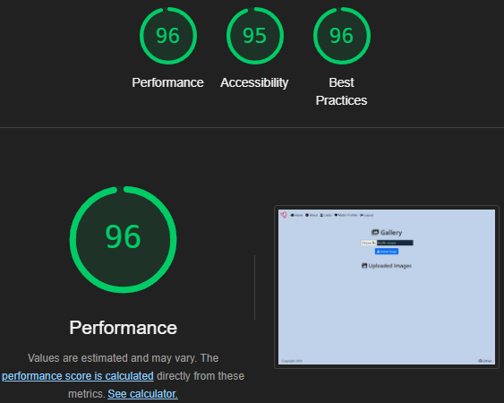

# Team 6 - [Giggle Dates](https://team6-feb25hackathon-f88a0e757625.herokuapp.com/) - Feb25Hackathon
# Code Institute "February 2025 - Love.exe!" <a id="top"/>

 

## Introduction
The present website was done as part of the February Hackathon organised by Code Institute (CI) in 2025. 

## Table of Contents
- [User Experience Design](#user-experience-design)
- [Project Brief](#project-brief)
- [Users](#users)
- [Project Plan](#project-plan)
- [User Stories](#user-stories)
- [Wireframes](#wireframes)
- [Design](#design)
    - [Colour Scheme](#colour-scheme)
    - [Logo](#logo)
    - [Typography](#typography)
- [Website Features](#website-features)
    - [Common Features](#common-featureslinks-to-most-pages)
    - [Homepage](#homepage)
    - [About](#about)
    - [Register](#register)
    - [Login](#login)
    - [Signup](#signup)
    - [Profile](#profile)
    - [Match](#match)
- [Responsive Design](#responsive-design)
- [Future Features](#future-features)
- [Technologies Used](#technologies-used)
- [Deployment](#deployment)
- [Testing](#testing)
- [Credits](#credits)
    - [Use of AI](#use-of-ai)
    - [Acknowledgements](#acknowledgements)
    - [Group Members](#group-members)

[Back to top](#top)

## User Experience Design
The user experience for this site was optimized with the use of Bootstrap, CSS and React. 
The website provides a smooth experience for the user with the background colour and text colour showing an overall great contrast. 
There is the option to use the default colour scheme that is also the light mode and to use a dark version of the website.
Users with difficulty to read the words, can use the dyslexia mode.

### Project Brief
The idea for this project came from the organisation of this hackathon, that requested the different groups to create a dating app that would be inclusive. 
Initially there were some ideas, like a dark and light more and also a way to help users with dyslexia, which the team was able to implement.

### Users
In order to fully understand our users needs, we asked Microsoft Co-pilot to draw up some user personas based on our project brief. We refined the prompts and here are the personas we used:

Persona 1: Alex, The Open-Minded Explorer
Age: 28  Gender: Non-binary  Location: New York City, USA  Education: Bachelor's degree in Communications  Occupation: Freelance Graphic Designer

More info:

Personality Traits:
- Open-minded and adventurous
- Values diversity and inclusivity
- Enjoys meeting new people and exploring different cultures

Goals:
- Find a partner who shares their passion for adventure and inclusivity
- Connect with people from diverse backgrounds and experiences

Pain Points:
- Difficulty finding inclusive dating platforms
- Concerns about privacy and safety on dating apps

Quote: "I want to find someone who is as open-minded and adventurous as I am, and who values diversity as much as I do."

Persona 2: Jamie, The Supportive Friend
Age: 35  Gender: Female  Location: London, UK  Education: Master's degree in Psychology  Occupation: Clinical Psychologist

More info:

Personality Traits:
- Empathetic and supportive
- Values deep, meaningful connections
- Enjoys helping others and providing emotional support

Goals:
- Find a partner who is emotionally supportive and understanding
- Build a strong, long-lasting relationship

Pain Points:
- Difficulty finding partners who prioritize emotional support
- Concerns about meeting genuine people on dating apps

Quote: "I want to find someone who is emotionally supportive and understands the importance of mental health."

Persona 3: Taylor, The Creative Soul
Age: 24  Gender: Male  Location: Los Angeles, USA  Education: Bachelor's degree in Fine Arts  Occupation: Aspiring Musician

More info:

Personality Traits:
- Creative and expressive
- Values artistic and intellectual connections
- Enjoys exploring new ideas and experiences

Goals:
- Find a partner who shares their passion for creativity and art
- Connect with someone who appreciates their artistic pursuits

Pain Points:
- Difficulty finding partners who understand and support their creative endeavors
- Concerns about finding genuine connections on dating apps

Quote: "I want to find someone who appreciates my creativity and supports my artistic journey."

[Back to top](#top)

## Project Plan
Initially the group got together when the team was known after the first webinar. A repository was created and colaborators were adeed to allow different members to create their branches and work locally, as necessary. 
After this, a project board was also created on GitHub, different issues were created, according to different things that needed to be done on the website.  
Different issues were picked by diferent members of the group. We did our best to communicate and keep the project going and learn along the way. 

### User Stories
All user stories were logged on the [GitHub Project Board](https://github.com/users/j0hanz/projects/8) on GitHub repo, along with the assessment criteria and expected performance for the Hackatho 
There were also prioritised as must-have, should-have and could-have. 
As well as using the Project Board to track progress on our project, we also used it during testing to log any significant bugs that need to be fixed before the project deadline. 

[Back to top](#top)

### Wireframes
Initial layout of website in different devices:

- Mobile view: 
  
  
- Desktop/Laptop view: 
  

[Back to top](#top)

## Design
### Colour Scheme
This site was created with the following colours from the colour palette.

- Colour Palette  
  Done using [colorkit.co](https://colorkit.co/color-palette-generator/) 

  

- Contrast check  
  Contrast was checked using [WebAIM](https://webaim.org/resources/contrastchecker/) 
  
  
  

### Logo
 

[Back to top](#top)

### Typography
For the body section of the webpage, font-family used was: "Preconcept".
[Google Fonts](https://fonts.googleapis.com/css2?family=Inter:wght@400&family=Times+New+Roman:wght@400&family=Arial:wght@400&family=Lexend+Deca:wght@400&display=swap) 

For the Logo, font-family used was: "Brush Script MT", cursive. Example of "Brush Script MT" font from [Microsoft](https://learn.microsoft.com/en-us/typography/font-list/brush-script-mt)

[Back to top](#top)

## Website Features
### Common Features/Links to most pages
- Navbar

- GitHub repo link

- Signup button

### Homepage
- https://team6-feb25hackathon-f88a0e757625.herokuapp.com/

### About
- https://team6-feb25hackathon-f88a0e757625.herokuapp.com/

[Back to top](#top)

### Register
- https://team6-feb25hackathon-f88a0e757625.herokuapp.com/accounts/signup/

[Back to top](#top)

### Login
- https://team6-feb25hackathon-f88a0e757625.herokuapp.com/accounts/login/

### Signup
- https://team6-feb25hackathon-f88a0e757625.herokuapp.com/accounts/signup/

### Profile
- https://team6-feb25hackathon-f88a0e757625.herokuapp.com/profiles/

### Match
- https://team6-feb25hackathon-f88a0e757625.herokuapp.com/match/

[Back to top](#top)

## Responsive Design
Responsive design was achieved with the use of CSS and Bootstrap to optimize the display of the content in different screen sizes.
The most important for the team during this project were mobile screens and desktop screens

## Future Features
- Ability for users to send messages to each other
- Login with Social Networks
- Random selection of matching profiles

[Back to top](#top)

## Technologies Used
### Languages and Technologies

### Libraries

### Tools and Programs

### Frameworks

### DataBases

[Back to top](#top)

## Deployment

Heroku deployment process:
- This project uses Heroku, a platform as a service (PaaS) that enables developers to build, run, and operate applications entirely in the cloud.

Deployment steps are as follows, after account setup:

- Select New in the top-right corner of your Heroku Dashboard, and select Create new app from the dropdown menu.
- Your app name must be unique, and then choose a region closest to you (EU or USA), and finally, select Create App.
- From the new app Settings, click Reveal Config Vars, and set your environment variables.
  - | Key | Value |
  - | --- | --- |
  - | `AWS_ACCESS_KEY_ID` | user's own value |
  - | `AWS_SECRET_ACCESS_KEY` | user's own value |
  - | `DATABASE_URL` | user's own value |
  - | `DISABLE_COLLECTSTATIC` | 1 (*this is temporary, and can be removed for the final deployment*) |
  - | `EMAIL_HOST_PASS` | user's own value |
  - | `EMAIL_HOST_USER` | user's own value |
  - | `SECRET_KEY` | user's own value |
  - | `STRIPE_PUBLIC_KEY` | user's own value |
  - | `STRIPE_SECRET_KEY` | user's own value |
  - | `STRIPE_WH_SECRET` | user's own value |
  - | `USE_AWS` | True |
- Heroku needs three additional files in order to deploy properly.
  - requirements.txt
  - Procfile
  - runtime.txt
  - You can install this project's requirements (where applicable) using:
  - pip3 install -r requirements.txt
- If you have your own packages that have been installed, then the requirements file needs updated using:
  - pip3 freeze --local > requirements.txt
- The Procfile can be created with the following command:
  - echo web: gunicorn app_name.wsgi > Procfile
  - replace app_name with the name of your primary Django app name; the folder where settings.py is located
- The runtime.txt file needs to know which Python version you're using:
  - type: python3 --version in the terminal.
  - in the runtime.txt file, add your Python version:
    - python-3.9.19
- For Heroku deployment, follow these steps to connect your own GitHub repository to the newly created app:
- Either:
  - Select Automatic Deployment from the Heroku app.
- Or:
  - In the Terminal/CLI, connect to Heroku using this command: heroku login -i
  - Set the remote for Heroku: heroku git:remote -a app_name (replace app_name with your app name)
  - After performing the standard Git add, commit, and push to GitHub, you can now type:
    - git push heroku main
- The project should now be connected and deployed to Heroku!

[Back to top](#top)

## Testing
Validation of HTML/CSS, Lighthouse Audits.

### HTML Validation
- Used [W3C Markup Validation Service](https://validator.w3.org/#validate_by_uri) to test the HTML on all webpages and updated as needed. No errors found after fixing.

### CSS Validation

- Used [W3C CSS Validation Service](https://jigsaw.w3.org/css-validator/#validate_by_input) to test CSS style and no errors found on all pages for style.

[Back to top](#top)

### Lighthouse Audit
Used Chrome Dev Tools Lighthouse to audit the site for response time and accessibility.  

[Back to top](#top)

## Credits
### Use of AI
#### Code Generation
Copilot was used on the creation of code for different languages, to review the code and get suggestions of code to help update or enhance features of the site.

#### Debugging
AI - Copilot extension for VS-Code was used to understand code used and also to correct it after testing and checking if all changes were working well.

### Acknowledgements
This was a stressfull period/hackathon, due to the team staring with 6-7 members and finishing with 2 members. 
The team manager kept the team going and tried to contact different elements of the team to check if they were still interested in helping. 
We had some merge conflicts that were promptly resolved by the team manager who was kind and patient enough to teach an aspiring junior developer and to show how to do different things. 
The result it's not as we wished, but overall, we are happy with the result achieved with the small team that was left.

### Group Members
https://github.com/j0hanz
https://github.com/Carlos-n21

[Back to top](#top)
